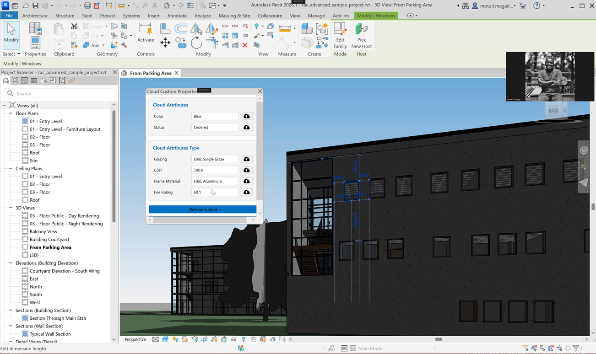

# Revit AEC Data Model Custom Properties Sample

## Description

This is a sample Autodesk Revit 2026 add-in, built with .NET 8.0, that demonstrates how to connect Revit family element to the **Autodesk AEC Data Model API**.

In this sample we will use a **Door** or **Window** in a specific cloud-hosted Revit model. When a user selects them, a property windows pane opens up on the right hand side. This pane fetches, displays, and allows updating of custom "extension properties" stored in the AEC Data Model, all powered by its GraphQL API.

# Thumbnail

## Core APIs & Features

* **Revit API**:
    * `IExternalApplication` to initialize the add-in and manage authentication.
    * Dockable Panes (`IDockablePaneProvider`) to create the custom UI.
    * Event Handlers (`SelectionChanged`, `ViewActivated`) to react to user actions.
    * `ExternalEvent` to safely update the UI from Revit events.
* **APS Authentication API**:
    * Handles the 3-legged OAuth 2.0 flow.
    * Uses a local `HttpListener` to capture the login callback.
* **AEC Data Model API (GraphQL)**:
    * Fetches Hubs, Projects, and Element Groups.
    * `GetAssociatedElementIdsAsync`: Queries for cloud elements (both instance and type) based on the Revit element's `UniqueId`.
    * `GetExtensionPropertiesAsync`: Fetches custom "extension" properties associated with the cloud elements.
    * `UpdateExtensionPropertiesOnElements`: Saves modified properties back to the cloud.
* **WPF / .NET**:
    * A custom WPF `UserControl` (`AttributesPanelProvider.cs`) serves as the UI for the dockable pane.
    * `HttpClient` is used for all GraphQL communication.
    * A simple in-memory cache (`MemoryStorage.cs`) reduces redundant API calls.

## Prerequisites

1.  **Revit 2026**: This add-in is built against the Revit 2026 API.
2.  **.NET 8.0 SDK**: Required to build the project.
3.  **Visual Studio 2022**: Recommended for building and debugging.
4.  **APS Account & App**:
    * An APS account created at `https://aps.autodesk.com`.
    * An app created at `https://aps.autodesk.com/myapps/`.
5.  **ACC/BIM 360 Project**:
    * A project on Autodesk Construction Cloud with docs enabled.
    * Your APS App (the `ClientId`) must be integrated into this project.

## 🚀 Setup & Run

### 1. Configure Your APS App

1.  Go to the [APS Developer Portal](https://aps.autodesk.com/myapps/) and create a new app.
2.  Enable the **AEC Data Model API** and **Authentication API**.
3.  Set the **Callback URL** to `http://localhost:3000/api/aps/callback/oauth`.
4.  Note your **Client ID** and **Client Secret**.

### 2. Configure the Solution

1.  Clone this repository
2.  Open the `revit_aec_dm_extensibility_sample.sln` in Visual Studio 2022.
3.  Install dependencies: `dotnet restore`
4.  In the `revit_aec_dm_extensibility_sample` project, find the `appsettings.json` file.
5.  Set the `ClientId` and `ClientSecret` with your values from Step 1.
6.  Ensure `appsettings.json` is set as an **Embedded Resource** in its file properties and do not copy to output directory.

### 3. Set Up Your Cloud Model

1.  Log in to your ACC/BIM 360 project.
2.  Upload a Revit 2026 sample file with extensible elements.
3.  Go to **Account Admin** > **Custom Integrations** > **Apps** and add your APS App (using its Client ID) to the project. This grants it permission to read data.

### 4. Build and Run the Add-in

1.  Build the solution in Visual Studio (Release mode) using .
2.  This action will copy all the contents (all `.dll` files) and the `revit-aec-dm-extensibility-sample.addin` file to your Revit Add-ins folder:
    * `%AppData%\Autodesk\Revit\Addins\2026\`
3.  Revit 2026 will automatically start.
4.  On startup, a Chrome window will open asking you to log in to your Autodesk account.
5.  Log in and grant the required permissions. You should see a "Login Success" message.
6.  Open the uploaded cloud model from the *Autodesk projects* section in Revit that you set up in Step 3.
7.  Click on any **Door** or **Window** element.
8.  The **"Cloud Custom Properties"** panel will appear, docked next to the right.
9.  The panel will show "Loading..." and then display two cards:
    * **Cloud Attributes**: Properties for the selected element instance.
    * **Cloud Attributes Type**: Properties for the element's type.
10.  You can edit the values in the text boxes and click the individual upload button or the **"Save All to Cloud"** button to update the properties in the AEC Data Model.
11.  Clicking on any other element type (or selecting multiple elements) will hide the custom panel.

For details, please watch the following video:

- 

## Troubleshooting

Please contact us via https://aps.autodesk.com/en/support/get-help.

## License

This sample is licensed under the terms of the [MIT License](http://opensource.org/licenses/MIT).
Please see the [LICENSE](LICENSE) file for more details.

# Written by

[Moturi Magati George](https://www.linkedin.com/in/moturigeorge/), [Autodesk Partner Development](http://aps.autodesk.com)